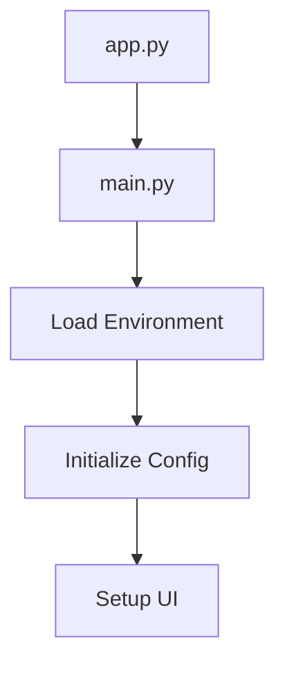

# 🏗️ Architecture Documentation - GenAI PDF Chatbot v2.0

## 📋 Overview

The GenAI PDF Chatbot has been completely refactored from a monolithic structure into a **modular, production-ready architecture** with **ChromaDB support** and **enhanced maintainability**. This document outlines the new architecture, design patterns, and module responsibilities.

## 🎯 Architecture Goals

- **Modularity**: Clear separation of concerns with single-responsibility modules
- **Maintainability**: Easy to understand, modify, and extend
- **Scalability**: Support for multiple vector database backends
- **Professional Quality**: Production-ready code with comprehensive error handling
- **Type Safety**: Full type annotations and validation throughout

## 📁 Project Structure

```pwsh
GenAI.Chatbot.FromPDF/
├── � Modular_App/                 # 🧩 Modular Application Code
│   ├── app.py                      # Main application launcher
│   ├── main.py                     # Core application orchestration
│   ├── config.py                   # Centralized configuration management
│
├── 🧩 Core Modules
│   ├── auth.py                     # Authentication & authorization
│   ├── document_processor.py       # PDF processing & text extraction
│   ├── vector_store.py             # Vector database abstraction layer
│   ├── chat_engine.py              # Conversational AI & memory management
│   ├── ui_components.py            # Streamlit UI components
│   └── GenAI.Chatbot.AnsFromPDF.v2.py  # Legacy v2 compatibility
│
├── 📂 Docs/                        # 📚 Documentation
│   ├── ARCHITECTURE.md             # This file - architecture documentation
│   ├── FEATURES.md                 # Feature documentation & comparisons
│   ├── MIGRATION.md                # Migration guide from v1.0 to v2.0
│   ├── TROUBLESHOOTING.md          # Troubleshooting guide
│   └── CHANGELOG.md                # Version history & changes
│
├── GenAI.Chatbot.AnsFromPDF.v1.py # 🔄 Original v1.0 application
├── README.md                       # User guide & setup instructions
│
├── 📦 Dependencies & Configuration
│   ├── requirements.txt            # Python dependencies (updated with ChromaDB)
│   ├── .env                        # Environment variables (user-created)
│   └── .gitignore                  # Git ignore rules
│
└── 💾 Data Storage (auto-created)
    ├── vector_db/                  # FAISS database storage
    └── chroma_db/                  # ChromaDB storage
│
├── ⚙️ Configuration & Setup
│   ├── requirements.txt            # Python dependencies (updated)
│   ├── .env                        # Environment variables
│   ├── .gitignore                  # Git ignore rules
│   └── README.md                   # Project documentation
│
├── 🗄️ Data Storage (auto-created)
│   ├── vector_db/                  # FAISS database storage
│   ├── chroma_db/                  # ChromaDB storage
│   └── venv/                       # Virtual environment
│
└── 📚 Documentation
    ├── ARCHITECTURE.md             # This file
    └── API_REFERENCE.md            # API documentation (if needed)
```

## 🎯 Key Improvements

### 1. **Modular Design**

- **Single Responsibility**: Each module handles one specific concern
- **Loose Coupling**: Modules interact through well-defined interfaces
- **High Cohesion**: Related functionality grouped together
- **Easy Testing**: Each module can be tested independently

### 2. **Enhanced Features**

- **Dual Database Support**: Toggle between FAISS and ChromaDB
- **Professional Authentication**: Extensible auth system
- **Advanced Chat Interface**: Modern chat UI with history
- **Comprehensive Error Handling**: Graceful error management
- **Configuration Management**: Centralized settings

### 3. **Production Ready**

- **Type Hints**: Full type annotation support
- **Documentation**: Comprehensive docstrings
- **Error Recovery**: Robust error handling
- **Session Management**: Proper state management
- **Resource Cleanup**: Automatic cleanup of temporary files

## 🔧 Module Details

### **config.py** - Configuration Management

```python
# Centralized configuration with dataclasses
@dataclass
class AppConfig:
    APP_TITLE: str = "📚 Gen AI Chatbot with PDF Knowledge Base"
    CHUNK_SIZE: int = 1000
    # ... other settings

# Environment variable management
config_manager.get_openai_api_key()
config_manager.validate_environment()
```

### **auth.py** - Authentication System

```python
# Professional authentication with extensible design
auth_manager.require_authentication()
auth_manager.is_authenticated()
auth_manager.logout()
```

### **document_processor.py** - PDF Processing

```python
# Robust document processing with validation
document_processor.load_documents(files)
document_processor.validate_files(files)
document_processor.get_document_stats(docs)
```

### **vector_store.py** - Database Management

```python
# Abstracted vector store interface supporting multiple backends
vector_store_manager.set_database_type("faiss")  # or "chroma"
vector_store_manager.create_database(documents)
vector_store_manager.load_database()
vector_store_manager.merge_databases(existing, new_docs)
```

### **chat_engine.py** - Conversational AI

```python
# Advanced chat engine with memory management
chat_engine.initialize_chain(vector_db)
chat_engine.get_response(question)
conversation_manager.add_message(role, content)
```

### **ui_components.py** - User Interface

```python
# Reusable UI components for consistent interface
ui_components.show_chat_interface(vector_db)
ui_components.show_database_selector()
ui_components.show_processing_status(docs)
```

## 🔄 Application Flow

### 1. **Initialization**



### 2. **Authentication**

```mermaid
graph TD
    A[User Access] --> B[auth_manager.require_authentication()]
    B --> C{Valid Credentials?}
    C -->|Yes| D[Continue to App]
    C -->|No| E[Show Login Form]
```

### 3. **Document Processing**

```mermaid
graph TD
    A[Upload Files] --> B[document_processor.validate_files()]
    B --> C[document_processor.load_documents()]
    C --> D[document_processor.split_documents()]
    D --> E[Vector Database]
```

### 4. **Vector Database Management**

```mermaid
graph TD
    A[Select DB Type] --> B[vector_store_manager.set_database_type()]
    B --> C{Existing DB?}
    C -->|Yes| D[Load Existing]
    C -->|No| E[Create New]
    D --> F[Merge if Adding Docs]
    E --> G[Save to Storage]
    F --> G
```

### 5. **Chat Interaction**

```mermaid
graph TD
    A[User Question] --> B[chat_engine.get_response()]
    B --> C[Vector Similarity Search]
    C --> D[LLM Processing]
    D --> E[Generate Response]
    E --> F[conversation_manager.add_message()]
```

## 🚀 Running the Application

### **Development Mode**

```bash
# Using the new modular version
streamlit run Modular_App/app.py

# Or directly with main
streamlit run Modular_App/main.py
```

### **Production Deployment**

```bash
# Install dependencies
pip install -r requirements.txt

# Set environment variables
export OPENAI_API_KEY="your-key-here"

# Run application
streamlit run Modular_App/app.py --server.port 8501
```

## 🛠️ Extending the Application

### **Adding New Vector Databases**

1. Create new class implementing `VectorStoreInterface`
2. Add to `VectorStoreManager`
3. Update UI selector

### **Custom Authentication**

1. Extend `AuthManager` class
2. Override `_validate_credentials()` method
3. Add new authentication providers

### **New Document Types**

1. Extend `DocumentProcessor` class
2. Add new loaders for different file types
3. Update file validation logic

### **Enhanced UI Components**

1. Add new methods to `UIComponents`
2. Create reusable component patterns
3. Implement custom Streamlit components

## 🔍 Debugging and Monitoring

### **Logging**

```python
# Enable verbose mode in chat_engine.py
ConversationalRetrievalChain.from_llm(..., verbose=True)

# Add custom logging
import logging
logging.basicConfig(level=logging.INFO)
```

### **Performance Monitoring**

```python
# Track processing time
with st.spinner("Processing..."):
    start_time = time.time()
    result = process_documents()
    st.info(f"Completed in {time.time() - start_time:.2f}s")
```

## 📊 Benefits of Modular Architecture

### **For Developers**

- ✅ **Easy to Understand**: Clear separation of concerns
- ✅ **Easy to Modify**: Change one module without affecting others
- ✅ **Easy to Test**: Unit test individual components
- ✅ **Easy to Debug**: Isolated error tracking

### **For Users**

- ✅ **Better Performance**: Optimized module loading
- ✅ **More Features**: Enhanced capabilities
- ✅ **Better UX**: Professional interface design
- ✅ **More Reliable**: Comprehensive error handling

### **For Maintenance**

- ✅ **Scalable**: Easy to add new features
- ✅ **Maintainable**: Clear code organization
- ✅ **Extensible**: Plugin-like architecture
- ✅ **Upgradeable**: Independent module updates

## 🔮 Future Enhancements

The modular architecture makes it easy to add:

- 📊 Analytics and monitoring dashboard
- 🔌 Plugin system for custom processors
- 🌐 Multi-language support
- 🔄 Batch processing capabilities
- 📱 Mobile-responsive design
- 🔒 Advanced security features
- 📈 Performance optimization tools

---

**This modular architecture transforms the GenAI PDF Chatbot from a monolithic script into a professional, production-ready application that's easy to understand, extend, and maintain!**
