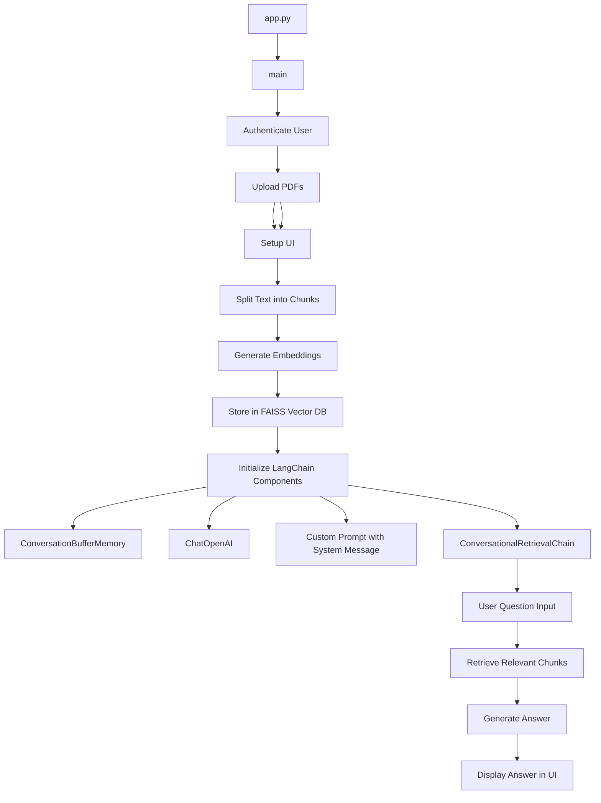
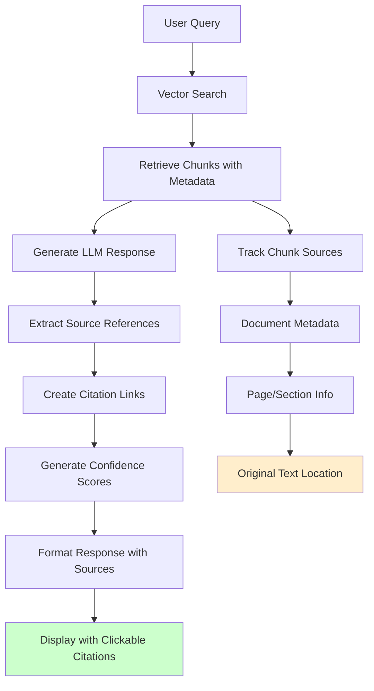
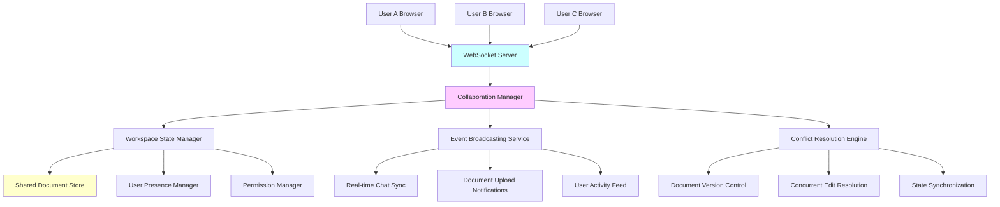
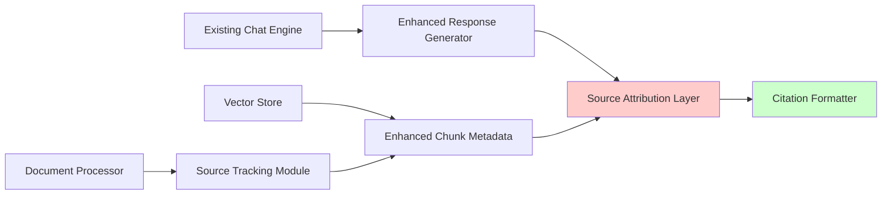
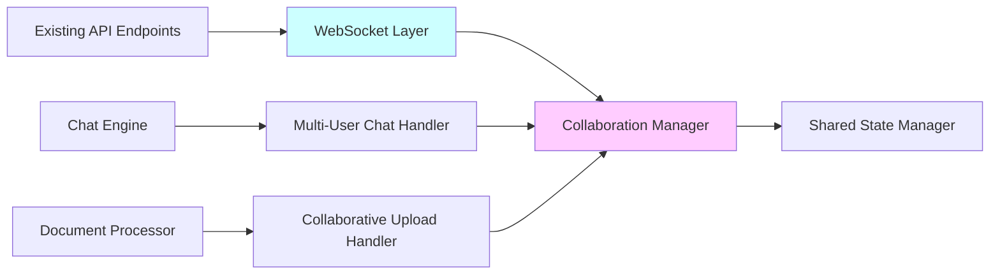

# 🏗️ Architecture Documentation - GenAI Enterprise Document Intelligence v3.0

## 📋 Overview

The GenAI Document Intelligence Platform has evolved from a simple PDF chatbot into a **comprehensive enterprise-grade document intelligence system** with **multi-format document processing**, **multi-AI provider support**, **multi-language capabilities**, and **REST API interface**. This document outlines the advanced architecture, design patterns, and system components.

## 🎯 Architecture Goals

- **Enterprise Scalability**: Multi-format, multi-language, multi-provider document processing
- **Dual Interface Support**: Simultaneous Web UI (Streamlit) and REST API (FastAPI) access
- **Provider Abstraction**: Unified interface for OpenAI, Anthropic, Google AI, and local models
- **Language Intelligence**: Automatic language detection and multilingual document understanding
- **Modularity**: Clear separation of concerns with enterprise-grade component architecture
- **Production Ready**: Comprehensive error handling, authentication, and monitoring capabilities
- **Type Safety**: Full type annotations and validation throughout all components

## 📁 Enhanced Project Structure

```pwsh
GenAI.Chatbot.FromPDF/
├── 🧩 Modular_App/                     # 🧩 Enterprise Modular Application Layer
│   ├── app.py                          # Main Streamlit application entry
│   ├── main.py                         # Application orchestration & coordination
│   ├── config.py                       # Multi-provider configuration system
│
├── 🧩 Core Modules
│   ├── auth.py                         # Authentication & authorization
│   ├── document_processor.py           # Multi-format document processing engine
│   ├── vector_store.py                 # Vector database abstraction layer
│   ├── chat_engine.py                  # Enhanced chat & conversation management
│   ├── ui_components.py                # Advanced Streamlit UI components
│   ├── multi_model_provider.py         # Multi-AI provider abstraction system
│   ├── api.py                          # FastAPI REST API server
│   └── GenAI.Chatbot.AnsFromPDF.v2.py  # Legacy v2 compatibility - GenAI Enterprise Document Intelligence v3.0
│
├── 📂 Docs/                            # Comprehensive Documentation Suite
│   ├── ARCHITECTURE.md                 # This file - system architecture
│   ├── FEATURES.md                     # Feature documentation & capabilities
│   ├── MIGRATION.md                    # Migration guide v1→v2→v3
│   ├── TROUBLESHOOTING.md              # Multi-format troubleshooting guide
│   ├── API_GUIDE.md                    # Complete REST API documentation
│   └── CHANGELOG.md                    # Version history & release notes
├── README.md                           # User guide & setup instructions
│
├── 🔄 Legacy Support
│   └── GenAI.Chatbot.AnsFromPDF.py     # Original application
│
├── 📋 Project Configuration
│   ├── requirements.txt                # Enhanced Python dependencies (25+)
│   ├── .env                            # Multi-provider environment variables (user-created)
│   └── .gitignore                      # Git ignore rules
│
└── 💾 Data Storage (auto-created)
│   ├── vector_db/                      # FAISS database storage
│   ├── chroma_db/                      # ChromaDB storage
│   └── uploads/                        # Temporary document storage
│   └── venv/                           # Virtual environment
│
```

## 🎯 Key Improvements

### 1. **Modular Design**

- **Single Responsibility**: Each module handles one specific concern
- **Loose Coupling**: Modules interact through well-defined interfaces
- **High Cohesion**: Related functionality grouped together
- **Easy Testing**: Each module can be tested independently

### 2. **Enhanced Features**

- **Dual Database Support**: Toggle between FAISS and ChromaDB
- **Professional Authentication**: Extensible auth system
- **Advanced Chat Interface**: Modern chat UI with history
- **Comprehensive Error Handling**: Graceful error management
- **Configuration Management**: Centralized settings

### 3. **Production Ready**

- **Type Hints**: Full type annotation support
- **Documentation**: Comprehensive docstrings
- **Error Recovery**: Robust error handling
- **Session Management**: Proper state management
- **Resource Cleanup**: Automatic cleanup of temporary files

## 🔧 Module Details

### **config.py** - Configuration Management

```python
# Centralized configuration with dataclasses
@dataclass
class AppConfig:
    APP_TITLE: str = "📚 Gen AI Chatbot with PDF Knowledge Base"
    CHUNK_SIZE: int = 1000
    # ... other settings

# Environment variable management
config_manager.get_openai_api_key()
config_manager.validate_environment()
```

### **auth.py** - Authentication System

```python
# Professional authentication with extensible design
auth_manager.require_authentication()
auth_manager.is_authenticated()
auth_manager.logout()
```

### **document_processor.py** - PDF Processing

```python
# Robust document processing with validation
document_processor.load_documents(files)
document_processor.validate_files(files)
document_processor.get_document_stats(docs)
```

### **vector_store.py** - Database Management

```python
# Abstracted vector store interface supporting multiple backends
vector_store_manager.set_database_type("faiss")  # or "chroma"
vector_store_manager.create_database(documents)
vector_store_manager.load_database()
vector_store_manager.merge_databases(existing, new_docs)
```

### **chat_engine.py** - Conversational AI

```python
# Advanced chat engine with memory management
chat_engine.initialize_chain(vector_db)
chat_engine.get_response(question)
conversation_manager.add_message(role, content)
```

### **ui_components.py** - User Interface

```python
# Reusable UI components for consistent interface
ui_components.show_chat_interface(vector_db)
ui_components.show_database_selector()
ui_components.show_processing_status(docs)
```

## 🔄 Application Flow

## Gent AI Chatbot Architecture



### 1. **Initialization**


### 2. **Authentication & Security Flow**


### 3. **JWT Authentication Lifecycle**


### 4. **Document Processing**


### 5. **Vector Database Management**


### 6. **Chat Interaction**


## 🚀 Running the Application

### **Development Mode**

```bash
# Using the new modular version
streamlit run Modular_App/app.py

# Or directly with main
streamlit run Modular_App/main.py
```

### **Production Deployment**

```bash
# Install dependencies
pip install -r requirements.txt

# Set environment variables
export OPENAI_API_KEY="your-key-here"

# Run application
streamlit run Modular_App/app.py --server.port 8501
```

## 🛠️ Extending the Application

### **Adding New Vector Databases**

1. Create new class implementing `VectorStoreInterface`
2. Add to `VectorStoreManager`
3. Update UI selector

### **Custom Authentication**

1. Extend `AuthManager` class
2. Override `_validate_credentials()` method
3. Add new authentication providers

### **New Document Types**

1. Extend `DocumentProcessor` class
2. Add new loaders for different file types
3. Update file validation logic

### **Enhanced UI Components**

1. Add new methods to `UIComponents`
2. Create reusable component patterns
3. Implement custom Streamlit components

## 🔍 Debugging and Monitoring

### **Logging**

```python
# Enable verbose mode in chat_engine.py
ConversationalRetrievalChain.from_llm(..., verbose=True)

# Add custom logging
import logging
logging.basicConfig(level=logging.INFO)
```

### **Performance Monitoring**

```python
# Track processing time
with st.spinner("Processing..."):
    start_time = time.time()
    result = process_documents()
    st.info(f"Completed in {time.time() - start_time:.2f}s")
```

## 📊 Benefits of Modular Architecture

### **For Developers**

- ✅ **Easy to Understand**: Clear separation of concerns
- ✅ **Easy to Modify**: Change one module without affecting others
- ✅ **Easy to Test**: Unit test individual components
- ✅ **Easy to Debug**: Isolated error tracking

### **For Users**

- ✅ **Better Performance**: Optimized module loading
- ✅ **More Features**: Enhanced capabilities
- ✅ **Better UX**: Professional interface design
- ✅ **More Reliable**: Comprehensive error handling

### **For Maintenance**

- ✅ **Scalable**: Easy to add new features
- ✅ **Maintainable**: Clear code organization
- ✅ **Extensible**: Plugin-like architecture
- ✅ **Upgradeable**: Independent module updates

## 🔮 Future Enhancement Architecture

The modular architecture makes it easy to add advanced features:

### � Document Source Attribution Architecture

#### **Core Components**

```python
class SourceAttributionManager:
    """Manages document source tracking and attribution."""
    
    def track_document_source(self, doc_id: str, chunk_id: str, 
                            page_num: int, section: str) -> SourceMetadata
    
    def generate_citations(self, response: str, 
                         sources: List[SourceMetadata]) -> AttributedResponse
    
    def create_source_links(self, doc_path: str, 
                          page: int, coordinates: Tuple) -> DocumentLink
```

#### **Attribution Flow Diagram**



#### **Data Models**

```python
@dataclass
class SourceMetadata:
    document_id: str
    document_name: str
    page_number: Optional[int]
    section_title: Optional[str]
    chunk_text: str
    confidence_score: float
    coordinates: Optional[Tuple[float, float, float, float]]
    timestamp: datetime

@dataclass
class AttributedResponse:
    response_text: str
    sources: List[SourceMetadata]
    citations: List[Citation]
    attribution_confidence: float

@dataclass
class Citation:
    text_snippet: str
    source_reference: str
    citation_format: str  # APA, MLA, Chicago, IEEE
    clickable_link: str
```

### 🤝 Real-time Collaborative Features Architecture

#### **Core Infrastructure**

```python
class CollaborationManager:
    """Manages real-time collaborative features."""
    
    def create_workspace(self, owner_id: str, name: str) -> Workspace
    def join_workspace(self, user_id: str, workspace_id: str) -> Session
    def broadcast_event(self, workspace_id: str, event: CollabEvent)
    def handle_concurrent_access(self, resource_id: str, action: Action)

class RealTimeEngine:
    """WebSocket-based real-time communication."""
    
    def establish_connection(self, user_id: str, workspace_id: str)
    def sync_user_presence(self, workspace_id: str, user_list: List[User])
    def broadcast_chat_message(self, message: ChatMessage)
    def notify_document_changes(self, doc_event: DocumentEvent)
```

#### **Collaborative Architecture Diagram**



#### **Real-time Data Models**

```python
@dataclass
class Workspace:
    id: str
    name: str
    owner_id: str
    members: List[WorkspaceMember]
    documents: List[Document]
    chat_sessions: List[ChatSession]
    created_at: datetime
    settings: WorkspaceSettings

@dataclass
class CollabEvent:
    event_type: str  # 'chat_message', 'document_upload', 'user_join'
    workspace_id: str
    user_id: str
    timestamp: datetime
    data: Dict[str, Any]

@dataclass
class UserPresence:
    user_id: str
    workspace_id: str
    status: str  # 'active', 'idle', 'away'
    last_seen: datetime
    current_activity: Optional[str]
```

#### **WebSocket Event Handling**

```python
class WebSocketHandler:
    """Handles real-time WebSocket connections."""
    
    async def handle_user_join(self, user_id: str, workspace_id: str):
        """Handle user joining workspace."""
        await self.broadcast_user_presence(workspace_id, user_id, 'joined')
        await self.send_workspace_state(user_id, workspace_id)
    
    async def handle_chat_message(self, message: ChatMessage):
        """Broadcast chat message to all workspace members."""
        await self.broadcast_to_workspace(message.workspace_id, {
            'type': 'chat_message',
            'data': message.to_dict()
        })
    
    async def handle_document_upload(self, upload_event: DocumentUploadEvent):
        """Notify all users of new document upload."""
        await self.broadcast_to_workspace(upload_event.workspace_id, {
            'type': 'document_uploaded',
            'data': upload_event.to_dict()
        })
```

### 🔄 Integration Architecture

#### **Source Attribution Integration Points**



#### **Collaborative Features Integration**



### 📊 Advanced Analytics & Monitoring

#### **Analytics Architecture**

```python
class AnalyticsManager:
    """Comprehensive usage analytics and monitoring."""
    
    def track_user_activity(self, user_id: str, action: str, context: Dict)
    def monitor_system_performance(self) -> SystemMetrics
    def generate_usage_reports(self, workspace_id: str) -> UsageReport
    def track_ai_provider_costs(self, provider: str, usage: Usage) -> CostMetrics

@dataclass
class UsageReport:
    workspace_id: str
    period: DateRange
    user_activity: Dict[str, UserActivityMetrics]
    document_stats: DocumentUsageStats
    chat_analytics: ChatAnalytics
    cost_breakdown: CostBreakdown
```

### 🚀 Implementation Roadmap

1. **Phase 1**: Document Source Attribution
   - Enhance vector store with detailed metadata tracking
   - Implement citation generation system
   - Add source linking capabilities

2. **Phase 2**: Basic Collaboration
   - WebSocket infrastructure setup
   - User presence management
   - Shared workspace creation

3. **Phase 3**: Advanced Collaboration
   - Real-time chat synchronization
   - Collaborative document management
   - Conflict resolution implementation

4. **Phase 4**: Analytics & Optimization
   - Usage analytics dashboard
   - Performance monitoring
   - Cost optimization features

---

**This enhanced architecture provides a clear roadmap for implementing advanced features while maintaining the modular, scalable design principles!**
